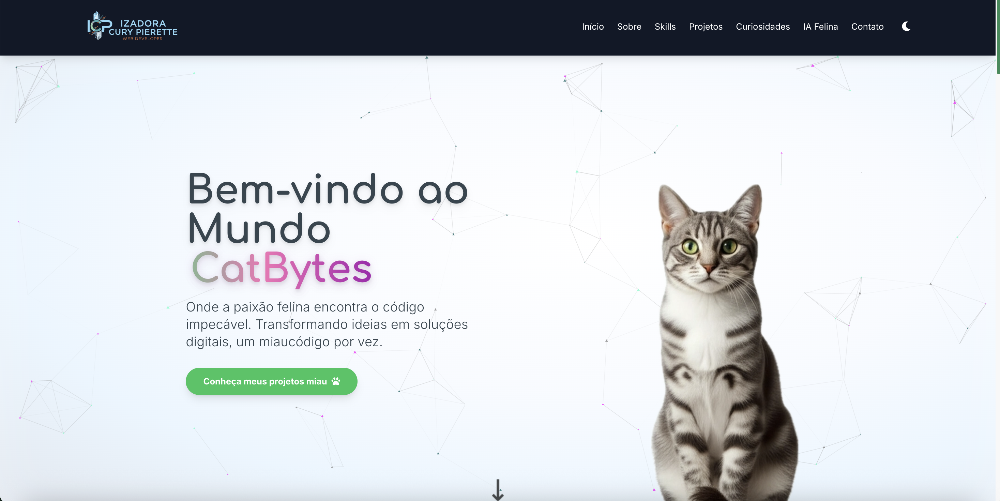
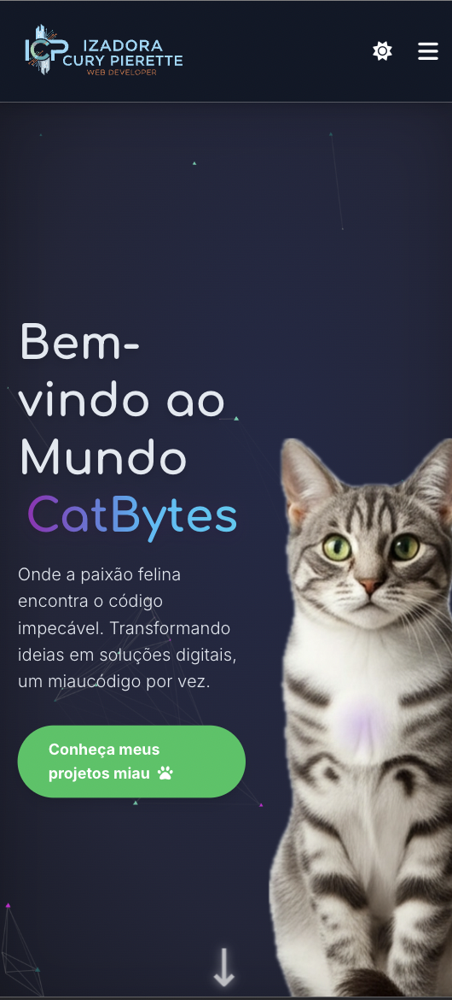

# 🐱 CatBytes – Portfólio e Laboratório de IA (Front-end + Netlify Functions)

CatBytes é meu portfólio vivo (HTML, CSS, JS) com experimentos de IA e automação. Agora as funcionalidades de IA rodam **via Netlify Functions**, mantendo o front-end estático e o back-end _serverless_.

> **Status:** ativo • focado em acessibilidade, performance e código modular • pronto para evoluir para React quando fizer sentido.

---

## 🔥 Preview
```md


```

---

## ✨ Principais recursos

- **UI/UX responsivo** com CSS modular (reset, variables, components, responsive).
- **Animações leves** (IntersectionObserver, classes CSS utilitárias, partículas de fundo).
- **Acessibilidade**: semântica, contraste, navegação por teclado, ARIA nos componentes interativos.
- **IA (Netlify Functions + Gemini)**:
  - `generate-ad`: gera **anúncio de doação de gato** + **estratégia de postagem** (canais, quem marcar, hashtags).
  - `identify-cat`: identifica **características do gato** a partir de imagem (ex.: possível raça/traços gerais).  
    _Obs.: não coleta nem tenta inferir atributos sensíveis de pessoas, não diagnostica o animal apenas utiliza IA para avaliação superficial e estimada._
  - `adopt-cat`: integrações/buscas para adoção (e fallback com links genéricos quando os parceiros não retornam dados).
- **Tabs “IA Felina”** (JS puro): toda a resposta da IA é **injetada via JS** sem alterar HTML/CSS base.
- **Testes de responsividade** automatizados (spec inicial em `test/responsive.spec.ts`).

---

## 🧱 Estrutura de pastas (atual)

```text
css/
├─ components/
│  ├─ animations.css
│  ├─ skills.css
│  ├─ reset.css
│  ├─ responsive.css
│  ├─ style.css
│  ├─ tailwind-input.css
│  └─ variables.css
├─ images/
js/
└─ modules/
   ├─ adoptCat.js
   ├─ animations.js
   ├─ contactForm.js
   ├─ generateAd.js
   ├─ iaTabs.js
   ├─ identifyCat.js
   ├─ projectsGallery.js
   ├─ skillsCarousel.js
   ├─ ui.js
   ├─ config-particles.js
   └─ main.js
netlify/
└─ functions/
   ├─ adopt-cat.js
   ├─ generate-ad.js
   └─ identify-cat.js
test/
└─ responsive.spec.ts
index.html
netlify.toml
postcss.config.js
tailwind.config.js
package.json
package-lock.json
README.md
```

---

## 🛠️ Stack

- **Front-end:** HTML semântico, CSS modular, JS ES Modules
- **Estilo utilitário:** Tailwind (via `tailwind-input.css` + build PostCSS)
- **Back-end:** Netlify Functions (Node 18+)
- **IA:** Google Gemini (via API key no ambiente do Netlify)
- **Build:** PostCSS + Autoprefixer (ver `postcss.config.js`)
- **Testes:** Playwright (spec inicial de responsividade)

---

## ⚙️ Configuração e uso

### 1) Pré-requisitos
- Node 18+
- (Opcional) **Netlify CLI** para rodar functions localmente:  
  `npm i -g netlify-cli`

### 2) Variáveis de ambiente
Crie `GEMINI_API_KEY` no **painel do Netlify** (Site → Site settings → Build & deploy → Environment).  
Em local: `netlify env:set GEMINI_API_KEY <sua-chave>`

### 3) Rodar localmente (com functions)
```bash
# instalar deps
npm install

# subir tudo (site estático + serverless functions)
netlify dev
# abre em http://localhost:8888 e proxy para /.netlify/functions/*
```

### 4) Build de CSS (Tailwind/PostCSS)
```bash
# exemplo comum (ajuste o script no package.json conforme seu setup)
npm run build:css
```

### 5) Deploy
- **Netlify**: conecte o repositório → configure `GEMINI_API_KEY` → deploy automático no push.
- Os endpoints ficam disponíveis em: `/.netlify/functions/<nome>`.

---

## 🧩 Endpoints (Netlify Functions)

> Todos os endpoints aceitam e retornam JSON. Em produção/local via `netlify dev`, prefixo: `/.netlify/functions`.

### `POST /.netlify/functions/generate-ad`
Gera o texto do anúncio + estratégia de postagem.

**Body (exemplo):**
```json
{
  "name": "Mingau",
  "age": "2 anos",
  "breed": "SRD (tigrado)",
  "health": "castrado, vacinado",
  "personality": "carinhoso, calmo, se dá bem com outros gatos",
  "requirements": "ambiente telado, termo de adoção",
  "location": "Campo Grande - MS"
}
```

**Resposta (exemplo resumido):**
```json
{
  "ad": "<texto pronto do anúncio>",
  "strategy": {
    "channels": ["Instagram", "Facebook Grupos", "ONGs locais"],
    "mentions": ["@ongs", "@influencers_pet"],
    "hashtags": ["#AdoteUmGato", "#AdoteMS", "#GatoDoação"],
    "posting_tips": ["Horários de melhor alcance", "Call-to-action", "Fotos recomendadas"]
  }
}
```

### `POST /.netlify/functions/identify-cat`
Recebe `multipart/form-data` com a imagem (campo `file`) e retorna **características do gato** (possível raça/traços).
> **Importante:** não coleta nem infere atributos sensíveis de pessoas.

### `POST /.netlify/functions/adopt-cat?q=<termo>`
Busca/adquire resultados de adoção (quando houver integração) e faz **fallback** para links genéricos confiáveis.

---

## 🧠 Como o front consome as funções (JS puro)

Exemplo (resumo) para `generate-ad`:

```js
async function generateAd(payload) {
  const res = await fetch('/.netlify/functions/generate-ad', {
    method: 'POST',
    headers: { 'Content-Type': 'application/json' },
    body: JSON.stringify(payload)
  });
  if (!res.ok) throw new Error('Falha ao gerar anúncio');
  return res.json();
}
```

Para `identify-cat` (upload de imagem):

```js
async function identifyCat(file) {
  const form = new FormData();
  form.append('file', file);
  const res = await fetch('/.netlify/functions/identify-cat', {
    method: 'POST',
    body: form
  });
  if (!res.ok) throw new Error('Falha ao identificar');
  return res.json();
}
```

---

## ✅ Acessibilidade & Performance

- Leitura de tela validada nos componentes interativos principais.
- Foco visível e navegação por teclado.
- Imagens com `alt` significativo e `loading="lazy"`.
- CSS e JS modulados e carregamento **progressivo** de efeitos.
- Preferência por **transições CSS** sobre JS para animações simples.

---

## 🧪 Testes (responsividade)

Spec inicial em `test/responsive.spec.ts` usando Playwright.
```bash
# instalar (se ainda não instalado)
npm i -D @playwright/test

# rodar (com servidor local ativo, ex: netlify dev)
npx playwright test
```

> Próximos passos: cobrir pontos de quebra principais (430px, 669px, 768px, 1024px, 1440px), navegação por teclado e regressão visual.

---

## 🗺️ Roadmap curto

- [ ] Melhorar fallback e mensagens quando integrações externas não respondem (adopt-cat).
- [ ] Limpar comentários dos arquivos, foram úteis durante o Desenvolvimento mas futuramente serão todos removidos.
- [ ] Adicionar testes de acessibilidade (axe) e smoke tests de tabs.
- [ ] Criar preset de animações com prefers-reduced-motion.
- [ ] Exportar componentes para futura migração gradual para **React**.

---

## 🧾 Licença

Uso livre para estudo e referência. **Não clonar como portfólio pessoal** sem **remover elementos e tema “CatBytes”**, conforme instruções no repositório.

---

## 🇬🇧 Short EN summary

CatBytes is my live front-end portfolio with serverless AI features via **Netlify Functions + Gemini**. It’s accessible, responsive, and modular. See `netlify/functions/*` for `generate-ad`, `identify-cat`, and `adopt-cat`. Run locally with `netlify dev`. Tests: Playwright (`test/responsive.spec.ts`).
